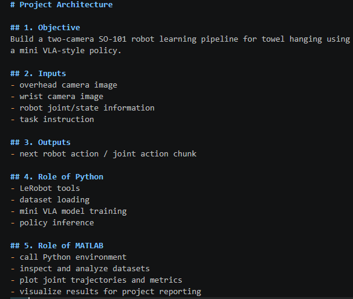

# Project Architecture

## 1. Objective
Build a two-camera SO-101 robot learning pipeline for towel hanging using a mini VLA-style policy.

## 2. Inputs
- overhead camera image
- wrist camera image
- robot joint/state information
- task instruction

## 3. Outputs
- next robot action / joint action chunk

## 4. Role of Python
- LeRobot tools
- dataset loading
- mini VLA model training
- policy inference

## 5. Role of MATLAB
- call Python environment
- inspect and analyze datasets
- plot joint trajectories and metrics
- visualize results for project reporting
okay